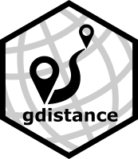

gdistance
============

<!-- badges: start -->
[](https://cran.r-project.org/package=gdistance) 
[](https://cran.r-project.org/web/checks/check_results_gdistance.html)
[](https://www.tidyverse.org/lifecycle/#stable)
[](https://cran.r-project.org/package=gdistance) 
[](http://dx.doi.org/10.18637/jss.v076.i13)
<!-- badges: end -->

# *gdistance*: Distances and Routes on Geographical Grids 

## Overview

**gdistance** provides classes and functions to calculate various distance measures and routes in heterogeneous geographic spaces represented as grids. Least-cost distances as well as more complex distances based on (constrained) random walks can be calculated. Also the corresponding routes or probabilities of passing each cell can be determined. The package implements classes to store the data about the probability or cost of transitioning from one cell to another on a grid in a memory-efficient sparse format. These classes make it possible to manipulate the values of cell-to-cell movement directly, which offers flexibility and the possibility to use asymmetric values. The novel distances implemented in the package are used in geographical genetics (applying circuit theory), but may also have applications in other fields of geospatial analysis.

## Package website

<https://agrdatasci.github.io/gdistance/>

## Installation

The package may be installed from CRAN via

``` r
install.packages("gdistance")
```

The development version can be installed via

``` r
library("devtools")
install_github("agrdatasci/gdistance")
```

## Going further

The full functionality of **gdistance** is illustrated in the package vignette. The vignette can be found on the [package website](https://agrdatasci.github.io/gdistance/) or from within `R` once the package has been installed, e.g. via

``` r
vignette("Overview", package = "gdistance")
```

## Meta

  - Please [report any issues or bugs](https://github.com/AgrDataSci/gdistance/issues).

  - License: GPL-3.

  - Get citation information for *gdistance* in R by typing `citation(package = "gdistance")`.

  - You are welcome to contribute to the *gdistance* project. Please read our [contribution guidelines](CONTRIBUTING.md).

  - Please note that the *gdistance* project is released with a [Contributor Code of Conduct](CODE_OF_CONDUCT.md). By participating in the *gdistance* project you agree to abide by its terms.
