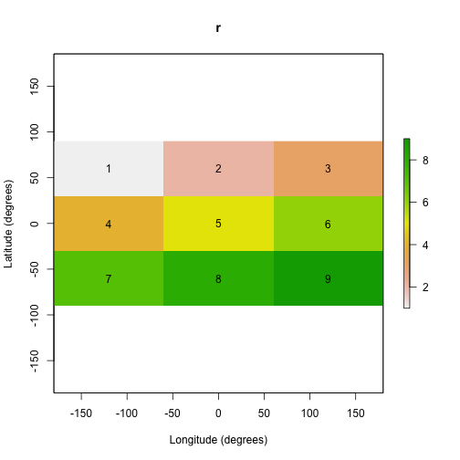

# Summary
The `R` package **gdistance** provides classes and functions to calculate various distance measures and routes in heterogeneous geographic spaces represented as grids. Least-cost distances as well as more complex distances based on (constrained) random walks can be calculated. Also the corresponding routes or probabilities of passing each cell can be determined. The package implements classes to store the data about the probability or cost of transitioning from one cell to another on a grid in a memory-efficient sparse format. These classes make it possible to manipulate the values of cell-to-cell movement directly, which offers flexibility and the possibility to use asymmetric values. The novel distances implemented in the package are used in geographical genetics (applying circuit theory), but may also have applications in other fields of geospatial analysis. 

This vignette was published as an article in the Journal of Statistical Software: 

> van Etten, Jacob. [-@etten2017]. “R Package gdistance: Distances and Routes on Geographical Grids.” **Journal of Statistical Software** 76 (13): 1–21. https://doi.org/10.18637/jss.v076.i13.

# Introduction: the crow, the wolf, and the drunkard

This vignette describes gdistance, a package written for use in the `R` environment [@R2014]. It provides functionality to calculate various distance measures and routes in heterogeneous geographic spaces represented as grids. Distance is fundamental to geospatial analysis [@tobler1970]. It is closely related to the concept of route. For example, take the great-circle distance, the most commonly used geographic distance measure. This distance represents the shortest line between two points, taking into account the curvature of the earth. Implicit in this distance measure is a route. The great-circle distance could be conceived of as the distance measured along a route of a very efficient traveller who knows where to go and has no obstacles to deal with.
In common language, this is referred to as distance `as the crow flies'.

Other distance measures also imply a route across geographic space. The least-cost distance is implemented in most GIS software and mimics route finding 'as the wolf runs', taking into account obstacles and the local `friction' of the landscape. Since least-cost distance is affected by the environment, grid-based calculations are necessary.
Other grid-based distances have been developed based on the random walk or drunkard's walk, in which route-finding is a stochastic process.

Package **gdistance** was designed to determine such grid-based distances and routes and to be used in combination with other packages available within R. The **gdistance** package is comparable to other software such as ArcGIS Spatial Analyst [@mccoy2002], GRASS GIS [@grass], and CircuitScape [@mcrae2008]. The gdistance package also contains specific functionality for geographical genetic analyses, not found in other software yet. The package implements measures to model dispersal histories first presented by [@etten2010].

# Theory

In **gdistance** calculations are done in various steps. This can be confusing at first for those who are used to distance and route calculations in GIS software, which are usually done in a single step. However, an important goal of **gdistance** is to make the calculations of distances and routes more flexible, which also makes the package more complicated to use. Users, therefore, need to have a basic understanding of the theory behind distance and route calculations.

Calculations of distances and routes start with raster data. In geospatial analysis, rasters are rectangular, regular grids that represent continuous data over geographical space. Cells are arranged in rows and columns and each holds a value. A raster is accompanied by metadata that indicate the resolution, extent and other properties.

Distance and route calculations on rasters rely on graph theory. So as a first step, rasters are converted into graphs by connecting cell centres to each other, which become the nodes in the graph. This can be done in various ways, but only three neighbourhood graphs are commonly implemented in distance calculation software (Figure 1).

 - Cells can be connected orthogonally to their four immediate neighbours, the von Neumann neighbourhood.
 - Cells can be connected with their eight orthogonal and diagonal nearest neighbours, the Moore neighbourhood. The resulting graph is called the king's graph, because it reflects all the legal movements of the king in chess. This is the most common and often only way to connect grids in GIS software.
 - Connecting the cell centres in 16 directions combines king's and knight's moves. The function r.cost in the software GRASS [@grass] has this as an option, which inspired its implementation in **gdistance**. 
The section on distance transforms in [@deSmith2009] also discusses 16-cell neighbourhoods. Connecting in 16 directions may increase the accuracy of the calculations.


When the raster is converted into a graph, weights are given to each edge (connections between nodes). These weights correspond to different concepts. In most GIS software, distance analyses are done with calculations using cost, friction or resistance values. In graph theory, weights can also correspond to conductance (1/resistance), which is equivalent to permeability (a term used in landscape ecology). The weights can also represent probabilities of transition.

Graphs are mathematically represented as matrices to do calculations. These can include transition probability matrices, adjacency matrices, resistance/conductance matrices, Laplacian matrices, among others. In **gdistance**, we refer collectively to these matrices to represent graphs as `transition matrices'. These transition matrices are the central object in the package; all distance calculations need one or more transition matrices as an input.

In **gdistance**, conductance rather than resistance values are expected in the transition matrix. An important advantage of using conductance is that it makes it possible to store values in computer memory very efficiently.
Conductance matrices usually contain mainly zeros, because cells are connected only with adjacent cells, and the conductance for direct connections between remote cells is zero. This makes conductance matrices suitable to store in the memory-efficient sparse matrix format. Sparse matrices do not store zero values explicitly in computer memory; 
they just store the non-zero values and their respective row and column indices and assume that the other values are zero. Sparse matrices do not work for resistance matrices, however, as resistance is infinite ($\infty$) between unconnected cells.

The calculation of the edge weights or conductance values is usually based on the values of the pair of grid cells to be connected. These cell values represent a property of the landscape. For instance, from a grid with altitude values, a value for the ease of walking can be calculated for each transition between cells. In **gdistance**, users define a function $f(i,j)$ to calculate the transition value for each pair of adjacent cells i and j.

With this approach, it is possible to create asymmetric matrices, in which the conductance from cell i to adjacent cell j is not always the same as the conductance from j back to i. This is relevant, among other things, for modelling travel in hilly terrain, as shown in Example 1 below. On the same slope, a downslope traveler experiences less friction than an upslope traveler. In this case, the function to calculate conductance values is non-commutative: $f(i,j) \neq f(j,i)$.

A problem that arises in grid-based modelling is the choice of weights that should be given to diagonal edges in proportion to orthogonal ones. For least-cost path distance and routes, this is fairly straightforward: weights are given in proportion to the distances between the cell centres. In a grid in which the orthogonal edges have a length of 1, the diagonal edges are  $\sqrt[]{2}$ long. [@mcrae2006] applies this same idea to random walks. However, as [@birch2006] explains, for random walks this is generally not the best discrete approximation of the dispersal process in continuous space. Different orthogonal and diagonal weights could be considered based on his analytical results.

For random walks on longitude-latitude grids, there is an additional consideration to be made. Considering the eight neighbouring cells in a Moore's neighbourhood, the three cells that are located nearer to the equator are larger in area than the three cells that are closer to the nearest pole, as the meridians converge when moving from the equator to either pole. So the cells closer to the poles should have a slightly lower probability of being reached during a random walk from the central cell. More theoretical work is needed to investigate possible solutions to this problem.
For projected grids and small areas, we can safely ignore the surface distortion.

When the transition matrix has been constructed, different algorithms to calculate distances and routes are applied.

* The least-cost distance mimics route finding 'as the wolf runs', taking into account obstacles and the local 'friction' of the landscape. In **gdistance** the least-cost path between two cells on the grid and the associated distance is obtained with Dijkstra's algorithm [@dijkstra1959].
* A second type of route-finding is the random walk, which has no predetermined destination (a 'drunkard's walk'). Commute distance represents the random walk commute time, e.g., the average number of edges traversed during a random walk from an starting point on the graph to a destination point and back again to the starting point [@chandra1996]. Resistance distance reflects the average travel cost during this walk [@mcrae2006]. When taken on the same graph these two measures differ only in their scaling [@kivimaki2012]. Commute and resistance distances are calculated using the analogy with an electrical circuit see [@doyle1984] for an introduction. The algorithm that **gdistance** uses to calculate commute distances was developed by [@fouss2007].
* A third type of route-finding is by randomised shortest paths, which are an intermediate form between shortest paths and Brownian random walks, introduced by [@saerens2009]. By setting a parameter, $\theta$ (theta), in the randomised shortest paths calculation, distances and routes can be made more randomised. A lower value of $\theta$ means that walkers explore more around the shortest path. When $\theta$ approaches zero, the randomised shortest paths approach a random walk. [@etten2010] applied randomised shortest paths in geospatial analysis (and see Example 2 below).

# Raster basics

Analyses in **gdistance** start with one or more rasters. For this, it relies on another `R` package, **raster** [@hijmans2012]. The **raster** package provides comprehensive geographical grid functionality. Here, we briefly discuss this package, referring the reader to the documentation of **raster** itself for more information. The following code shows how to create a raster object.


```r
library("gdistance")
set.seed(123)
r <- raster(ncol=3,nrow=3)
r[] <- 1:ncell(r)
r
#> class      : RasterLayer 
#> dimensions : 3, 3, 9  (nrow, ncol, ncell)
#> resolution : 120, 60  (x, y)
#> extent     : -180, 180, -90, 90  (xmin, xmax, ymin, ymax)
#> crs        : +proj=longlat +datum=WGS84 +ellps=WGS84 +towgs84=0,0,0 
#> source     : memory
#> names      : layer 
#> values     : 1, 9  (min, max)
```


The first line loads the package **gdistance**, which automatically loads the package **raster** as well. 
The second line creates a simple raster with 3 columns and 3 rows. The third line assigns the values 1 to 9 as the values of the cells. The resulting object is inspected in the fourth line. As can be seen in the output, the object does not only hold the cell values, but also holds metadata about the geographical properties of the raster.

It can also be seen that this is an object of the class `RasterLayer`. This class is for objects that hold only one layer of grid data. There are other classes which allow more than one layer of data: `RasterStack` and `RasterBrick`. Collectively, these classes are referred to as `Raster*`. 
A class is a static entity designed to represent objects of a certain type using 'slots', which each hold different information about the object. Both **raster** and **gdistance** use so-called S4 classes, a formal object-oriented system in `R`. An advantage of using classes is that data and metadata stay together and remain coherent. Consistent use of classes makes it more difficult to have contradictions in the information about an object. For example, changing the number of rows of a grid also has an effect on the total number of cells. Information about these two types of information of the same object could become contradictory if we were allowed to change one without adjusting the other. Classes make operations more rigid to avoid such contradictions. Operations that are geographically incorrect can also be detected in this way. For example, when the user tries to add the values of two rasters of different projections, the **raster** package will detect the difference and throw an error.

Classes also make it easier for the users to work with complex data and functions. Since so much information can be stored in a consistent way in objects and passed to functions, these functions need fewer options. Functions can deduce from the class of the object that is given to it, what it needs to do. The use of classes, if well done, tends to produce cleaner, more easily readable, and more consistent scripts. One important thing to know about **raster** is how grid data are stored internally in `Raster*` objects. Consecutive cell numbers in rasters go from left to right and from top to bottom. The 3 x 3 raster we just created with its cell numbers is shown in Figure 2.




# Transition* classes

As explained in Section 2 on the theory behind **gdistance**, transition matrices are the backbone of the package. The key classes in **gdistance** are `TransitionLayer` and `TransitionStack`. Most functions in the package have an object of one of these classes as input or output.

`Transition*` objects can be constructed from an object of class `Raster*`. A `Transition*` object takes the necessary geographic references (projection, resolution, extent) from the original `Raster*` object. It also contains a matrix which represents a transition from one cell to another in the grid. Each row and column in the matrix represents a cell in the original `Raster*` object. Row 1 and column 1 in the transition matrix correspond to cell 1 in the original raster, row 2 and column 2 to cell 2, and so on. For example, the raster we just created would produce a 9 x 9 transition matrix with rows and columns numbered from 1 to 9 (see Figure 3 below).

The matrix is stored in a sparse format, as discussed in Section 2. The package **gdistance** makes use of sparse matrix classes and methods from the package **Matrix**, which gives access to fast procedures implemented in the `C` language [@maechler2012]. The construction of a `Transition*` object from a `Raster*` object is straightforward. We can define an arbitrary function to calculate the conductance values from the values of each pair of cells to be connected.

In the following chunk of code, we use the `RasterLayer` that was created above. First, we set all its values to unit.
The next line creates a `TransitionLayer`, setting the transition value between each pair of cells to the mean of the two cell values that are being connected. The `directions` argument is set to 8, which connects all cells to their 8 neighbours (Moore neighbourhood).


```r
r[] <- 1
tr1 <- transition(r, transitionFunction=mean, directions=8)
```

If we inspect the object we created, we see that the resulting `TransitionLayer` object retains much information from 
the original `RasterLayer` object.


```r
tr1
#> class      : TransitionLayer 
#> dimensions : 3, 3, 9  (nrow, ncol, ncell)
#> resolution : 120, 60  (x, y)
#> extent     : -180, 180, -90, 90  (xmin, xmax, ymin, ymax)
#> crs        : +proj=longlat +datum=WGS84 +ellps=WGS84 +towgs84=0,0,0 
#> values      : conductance 
#> matrix class: dsCMatrix
```

To illustrate how to create an asymmetric matrix, we first create a non-commutative distance function, `ncdf`. We then use this function as an argument in the function `transition`. To make sure that the resulting transition matrix is indeed asymmetric, we set the `symm` argument in `transition` to `FALSE`.


```r
r[] <- runif(9)
ncf <- function(x) max(x) - x[1] + x[2]
tr2 <- transition(r, ncf, 4, symm=FALSE)
tr2
#> class      : TransitionLayer 
#> dimensions : 3, 3, 9  (nrow, ncol, ncell)
#> resolution : 120, 60  (x, y)
#> extent     : -180, 180, -90, 90  (xmin, xmax, ymin, ymax)
#> crs        : +proj=longlat +datum=WGS84 +ellps=WGS84 +towgs84=0,0,0 
#> values      : conductance 
#> matrix class: dgCMatrix
```

Note the difference between `tr1` and `tr2` in the slot 'matrix class'. This slot holds information about the matrix class as defined in the package **Matrix** [@maechler2012]. The class `dsCMatrix` is for matrices that are symmetric. The class `dgCMatrix` holds an asymmetric matrix.

Different mathematical operations can be done with `Transition*` objects. This makes it possible to flexibly model different components of landscape friction.


```r
tr3 <- tr1*tr2
tr3 <- tr1+tr2
tr3 <- tr1*3
tr3 <- sqrt(tr1)
```

Operations with more than one object require that the different objects have the same resolution and extent. Also, it is possible to extract and replace values in the matrix using indices, in a similar way to the use of indices with simple matrices.


